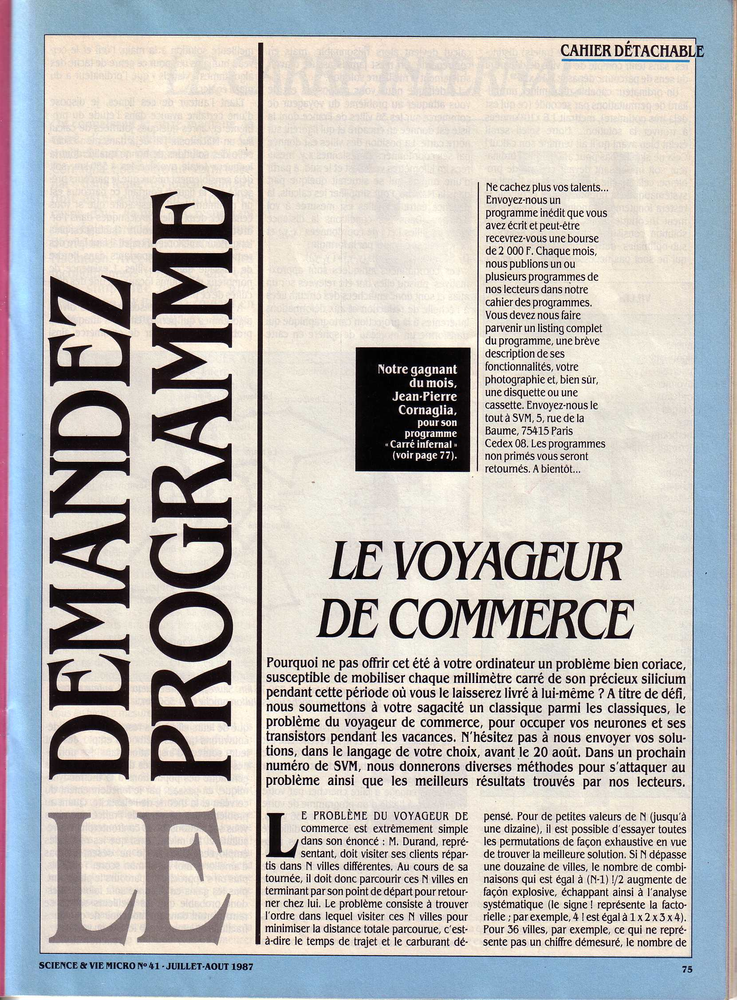
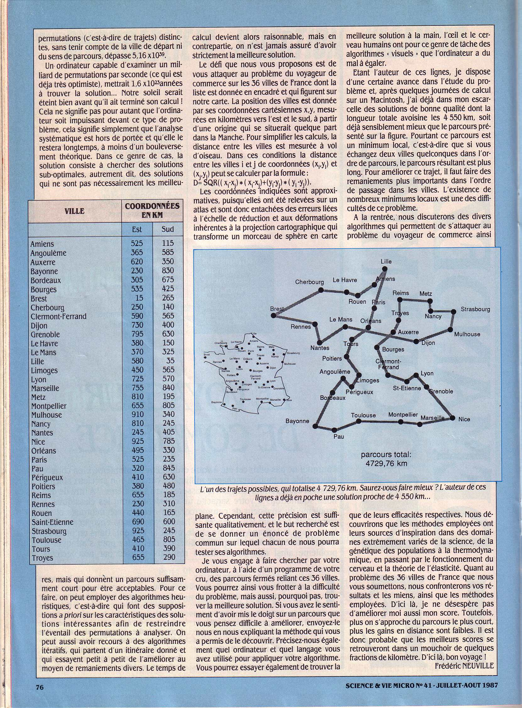

# &#x1F41C; Ant-Colony-Salesman &#x1F41C;

Ant colony optimization on the Travelling salesman problem.

Or how to find a good solution to help a travelling salesman to find one of the shortest (maybe the shortest) path joining 36 french cities and return back to the first one.

From Wikipedia:

Ant colony optimization algorithms have been applied to many combinatorial optimization problems, ranging from quadratic assignment to protein folding or routing vehicles and a lot of derived methods have been adapted to dynamic problems in real variables, stochastic problems, multi-targets and parallel implementations. It has also been used to produce near-optimal solutions to the travelling salesman problem. They have an advantage over simulated annealing and genetic algorithm approaches of similar problems when the graph may change dynamically; the ant colony algorithm can be run continuously and adapt to changes in real time. This is of interest in network routing and urban transportation systems.

The first ACO algorithm was called the ant system and it was aimed to solve the travelling salesman problem, in which the goal is to find the shortest round-trip to link a series of cities. The general algorithm is relatively simple and based on a set of ants, each making one of the possible round-trips along the cities. At each stage, the ant chooses to move from one city to another according to some rules:

- It must visit each city exactly once;
- A distant city has less chance of being chosen (the visibility);
- The more intense the pheromone trail laid out on an edge between two cities, the greater the probability that that edge will be chosen;
- Having completed its journey, the ant deposits more pheromones on all edges it traversed, if the journey is short;
- After each iteration, trails of pheromones evaporate.


Visualization of the ant colony algorithm applied to the travelling salesman problem. The whiter the line, the more pheromones there are. Selected solution appears in cyan. The path is considered stabilized if after 100 iterations the path distance stays nearly the same.

# Compilation on macOS
[CMakeFile](https://cmake.org/) build system is used to create a Makefile to build targets.<br/>
[SFML](https://www.sfml-dev.org/index-fr.php) graphic library is mandatory to display the vizualisation of the algorithm.<br/>
These tools are made availables with [homebrew](https://brew.sh/) on macOS.<br/>
Homebrew should be installed in /opt.
```
brew install cmake
brew install sfml
```

```
git clone https://github.com/rodolphe74/Ant-Colony-Salesman.git
cd Ant-Colony-Salesman
mkdir release
cd release
cmake .. -DCMAKE_BUILD_TYPE=Release
make
make install
```
make for console version.<br/>
make install for macOS bundled SFML version.

# References
-  &nbsp; 
- [How to Apply Ant Colony Optimization to Traveling Salesman Problem (TSP) Numerical Example~xRay Pixy](https://www.youtube.com/watch?v=8lYKzj470zc&t)
- [Ant colony optimization algorithm](https://www.youtube.com/watch?v=u7bQomllcJw&t)
